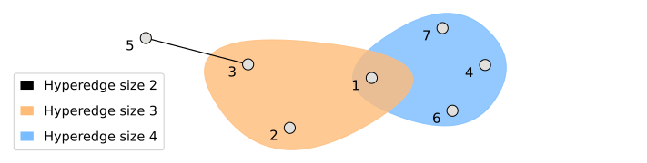

# Hypermotif
## An efficient tool for motif discovery in hypergraphs

#### Building
In order to build our application simply execute:

```sh
make
```
An executable file called "hypermotif" will be created.

To run follow the given structure:

```sh
./hypermotif -s <integer> -i <input_file> [... optinal arguments...]
```

#### Input Format

An edge list format is used.
A Hypergraph is encoded as a list of edges of the following form:

```
e11 e12 ... e1n         
e21 e22 ... e2m         
...
en1 en2 ... enk 
```

A valid input for the following hypergraph:



is:

```
3 5
1 2 3
1 4 6 7
```
 
##### Input restrictions

* Each edge should have size between 2 and 4. No duplicate vertices should be included.
* However, the code will try to detect such cases and recover from a badly formatted input file.

#### List of arguments and parameters:

Mandatory arguments that must be included in every command

| Flag                | Description                               |
|---------------------|-------------------------------------------|
| -s <integer>        | Motif size (integer between $3$ and $4$)  |
| -i <string>         | Input file path (a string without spaces) |

List of optional arguments that ensure the behaviour desired by the user. If not specified
otherwise, the default value will be used.

| Flag                  | Description                                                 | Default                       |
|-----------------------|-------------------------------------------------------------|-------------------------------|
|       -d              | Request a detailed output                                   | Simple output                 |
|       -o <string>     | Modify the output file path                                 | report.txt                    |
|       -n <integer>    | Manually set the number of hypernodes                       | Minimum necessary             |
|       -m              | Opt for motif discovery                                     | Network-census                |
|       -z              | Use the z_score formula                                     | Significance Profile          |
|       -r <integer>    | Number of sample random networks (integer greater than $0$) | 1000                          |
|       -e <integer>    | Number of random edge shuffles (integer greater than $0$)   | 1000                          |
|       -a <integer>    | Select the desired algorithm (integer between $1$ and $4$)  | Our recommended choice        |

The flag -a <integer> may be used to select the desired algorithm, overriding our recommended choice. The number attributed to every existing algorithm is as follows:

| Flag                      | Algorithm                                       |
|---------------------------|-------------------------------------------------|
| -a 1                      | baseline                                        |
| -a 2                      | esu'                                            |
| -a 3                      | triangle                                        |
| -a 4                      | fase                                            |

Note that algorithm 3 (triangle) cannot be used with size 4. 

Our recommended choice, for $k=3$, is the method triangle, and for $k=4$, fase.

#### Sample valid commands


``` bash
./hypermotif -s 4 -i datasets/hs.edges -r 10 -m -d -a 4
./hypermotif -s 3 -i datasets/geology.edges -r 10 -m -d -a 1
./hypermotif -s 3 -i datasets/geology.edges
./hypermotif -s 4 -i datasets/geology.edges -r 10 -m -d -a 4
./hypermotif -s 3 -i datasets/geology.edges -a 1 -o geology
./hypermotif -s 4 -i datasets/hs.edges -a 1 -o ouput.out -r 2 -e 2 -m 
```
#### Datasets

The list of test datasets is provided in the folder "datasets".
The final test file has a ".edge" extension.
Some of them should be uncompressed first.

The random dataset is a big file and could not be uploaded. 
It is available at: https://drive.google.com/file/d/1T3cov10rd3RAxpXrbYXrQqFXy5eBhR8D/view?usp=sharing

#### License

This software is released under the "Artistic License 2.0". See the file "LICENSE" for more details.

This software uses nauty by Brendan McKay. Nauty's license restrictions apply to the usage of hypermotif.
This software uses FaSE by Pedro Paredes and Pedro Ribeiro. FaSE's license restrictions apply to the usage of hypermotif.
This software uses GTrie by Pedro Ribeiro. GTrie's license restrictions apply to the usage of hypermotif.

#### Test Environment

This tool has been tested on:
* Ubuntu 20.04.5 LTS
* g++ (Ubuntu 9.4.0-1ubuntu1~20.04.1) 9.4.0
